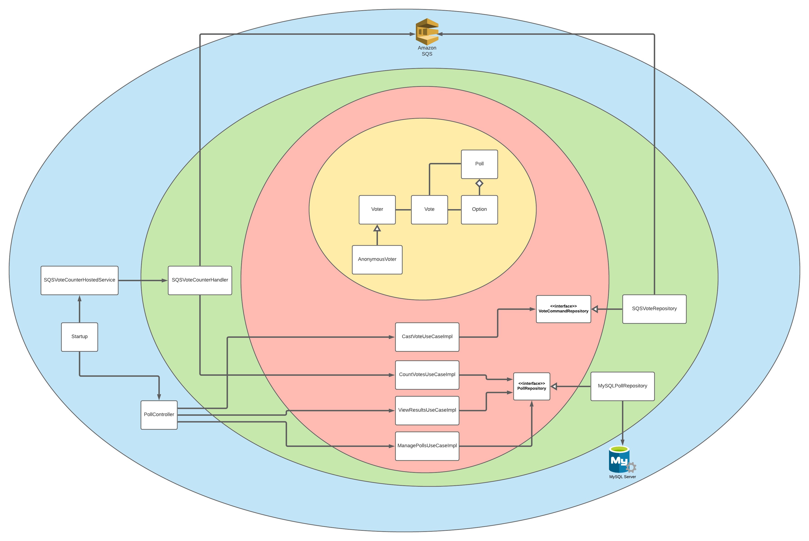
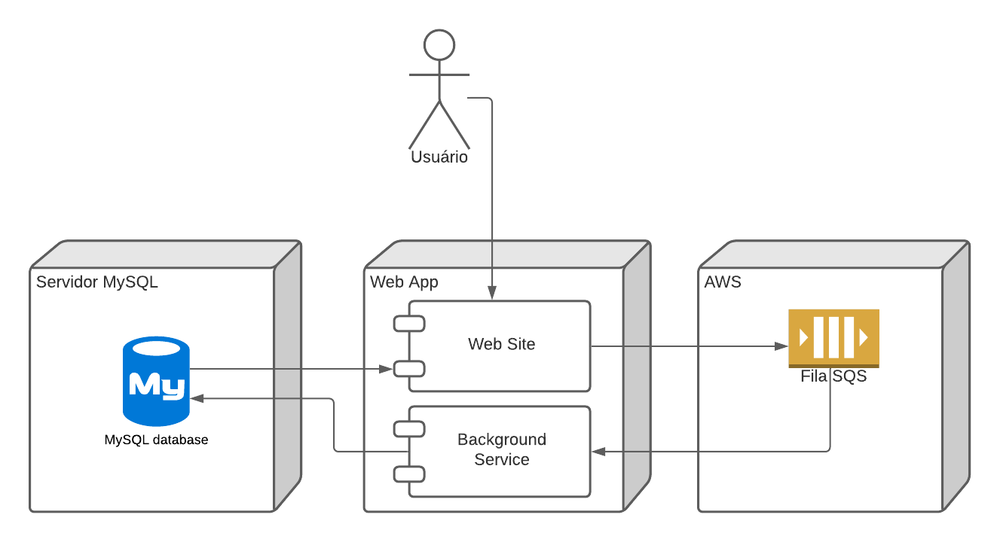

# Super Survey

Esta é um código de exemplo que simula uma aplicação de votação online.

Ela segue o padrão de arquitetura Clean Architecture, onde as classes foram separadas em camadas coocêntricas, de forma que as dependências sempre fluam de dentro para fora, ou seja, as camadas mais internas não conhecem as classes das camadas mais externas.

A visão abaixo fornece um entendimento mais simplificado dos componentes da aplicação. Além do código que roda num projeto ASP.NET, existe a necessidade de termos uma base MySQL e acesso a uma fila SQS da AWS. Para testes locais, está sendo utilizado o Localstack, que simula o serviço necessário.

Para os testes, está sendo utilizada a biblioteca Testcontainers para simular essas dependências citadas.